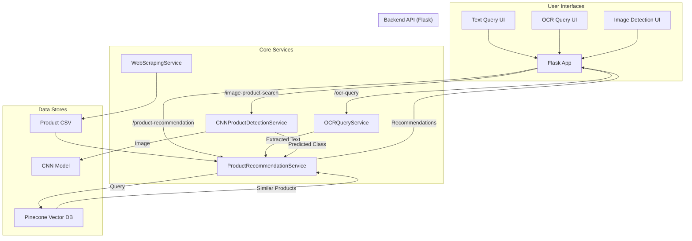

# E-commerce AI-Powered Product Discovery


---

## 1. Project Overview

This project is an AI-powered product discovery platform for e-commerce. It provides a set of services to help users find products using natural language queries, handwritten notes, and even product images. The system leverages a combination of natural language processing (NLP), computer vision (CV), and vector search technologies to deliver accurate and relevant product recommendations.

### Key Features:

-   **Text-based Product Search:** Find products using natural language queries.
-   **OCR-based Query:** Search for products by uploading an image of a handwritten note.
-   **Image-based Product Detection:** Discover products by uploading an image of the product itself.
-   **Scalable Vector Search:** Utilizes Pinecone for efficient and scalable similarity search.
-   **RESTful API:** Provides a set of endpoints for easy integration with frontend applications.

---

## 2. Design Overview

The application is built using a microservices-oriented architecture, with each service responsible for a specific functionality. The core of the application is the `ProductRecommendationService`, which uses a vector database to find similar products based on a given query. The `OCRQueryService` and `CNNProductDetectionService` act as specialized input processors that convert images into text or product categories, which are then fed into the recommendation service.

### Technology Stack:

-   **Backend:** Flask
-   **Vector Database:** Pinecone
-   **NLP:** sentence-transformers
-   **OCR:** Tesseract
-   **CV:** TensorFlow/Keras, OpenCV
-   **Web Scraping:** BeautifulSoup, Selenium
-   **Data Manipulation:** Pandas, NumPy

---

## 3. Architectural Flow

The following diagram illustrates the architectural flow of the system:



---

## 4. Services

The application is composed of the following services:

-   **ProductRecommendationService:** This is the core service responsible for finding and recommending products. It uses a sentence transformer model to generate vector embeddings for product descriptions and user queries, and then uses Pinecone to find the most similar products.

-   **OCRQueryService:** This service takes an image of a handwritten note, uses Tesseract to extract the text, and then passes the extracted text to the `ProductRecommendationService` to get product recommendations.

-   **CNNProductDetectionService:** This service uses a pre-trained Convolutional Neural Network (CNN) to identify the product category from an uploaded image. The predicted category is then used to query the `ProductRecommendationService` for relevant products.

-   **WebScrapingService:** This service provides functionalities to scrape product images from websites like Amazon using Selenium. It includes features for searching product categories, filtering out irrelevant images, and saving the downloaded images.

---

## 5. Setup Instructions

To get the application up and running, follow these steps:

### Prerequisites:

-   Python 3.9+
-   Tesseract OCR Engine
-   Pinecone account

### Installation:

1.  **Clone the repository:**

    ```bash
    git clone <repository-url>
    cd <repository-directory>
    ```

2.  **Create a virtual environment:**

    ```bash
    python -m venv venv
    source venv/bin/activate  # On Windows, use `venv\Scripts\activate`
    ```

3.  **Install the dependencies:**

    ```bash
    pip install -r requirements.txt
    ```

4.  **Set up environment variables:**

    Create a `.env` file in the root directory and add the following:

    ```
    PINECONE_API_KEY="your-pinecone-api-key"
    ```

5.  **Run the application:**

    ```bash
    python app.py
    ```

The application will be available at `http://127.0.0.1:5000`.

---

## 6. Usage Instructions

Once the application is running, you can interact with it through the web interface or the API.

### Web Interface:

-   **Text Search:** Navigate to `http://127.0.0.1:5000/text-search` to search for products using text queries.
-   **OCR Query:** Navigate to `http://127.0.0.1:5000/ocr-query` to upload an image of a handwritten note.
-   **Image Detection:** Navigate to `http://127.0.0.1:5000/image-detection` to upload a product image.

### API Usage:

You can also interact with the API directly. For detailed information about the available endpoints, see the API Documentation section.

---

## 7. API Documentation

The following are the main API endpoints available:

| Method | Endpoint                    | Description                                      |
| :----- | :-------------------------- | :----------------------------------------------- |
| POST   | `/product-recommendation`   | Recommends products based on a text query.       |
| POST   | `/ocr-query`                | Recommends products from a handwritten note image. |
| POST   | `/image-product-search`     | Recommends products from a product image.        |

### `/product-recommendation`

-   **Method:** `POST`
-   **Description:** Recommends products based on a natural language query.
-   **Form Data:**
    -   `query` (string, required): The user's query.
-   **Success Response (200):**

    ```json
    {
        "products": [
            {
                "id": "123",
                "name": "Product Name",
                "description": "Product Description"
            }
        ],
        "response": "Here are some products I found for you.",
        "query": "user query",
        "total_found": 1
    }
    ```

### `/ocr-query`

-   **Method:** `POST`
-   **Description:** Recommends products based on a handwritten note image.
-   **Form Data:**
    -   `image_data` (file, required): The image of the handwritten note.
-   **Success Response (200):**

    ```json
    {
        "products": [],
        "response": "Here are some products I found for you.",
        "extracted_text": "handwritten text",
        "ocr_confidence": 95.5
    }
    ```

### `/image-product-search`

-   **Method:** `POST`
-   **Description:** Recommends products based on a product image.
-   **Form Data:**
    -   `product_image` (file, required): The image of the product.
-   **Success Response (200):**

    ```json
    {
        "products": [],
        "response": "I detected a 'product-category' in your image...",
        "predicted_class": "product-category",
        "confidence": 0.98
    }
    ```

---

## 8. Dependencies

The project relies on the following packages:

| Package                 | Version      |
| :---------------------- | :----------- |
| flask                   | latest       |
| pinecone-client         | latest       |
| python-dotenv           | latest       |
| pandas                  | latest       |
| numpy                   | latest       |
| scikit-learn            | latest       |
| sentence-transformers   | latest       |
| pytesseract             | latest       |
| Pillow                  | latest       |
| opencv-python           | latest       |
| requests                | latest       |
| beautifulsoup4          | latest       |
| selenium                | latest       |
| webdriver-manager       | latest       |
| lxml                    | latest       |
| tensorflow              | latest       |
| keras                   | latest       |

---
